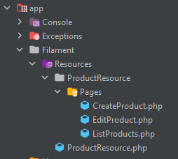

Corso: https://laraveldaily.teachable.com/courses/laravel-filament-admin-practical-course/lectures/41046347

Altri plugin: https://www.youtube.com/watch?v=X0TCNexv0SY

Filament: https://filamentphp.com/docs/2.x/admin/installation

Filament installa la parte visuale, di validazione, il FE diciamo

Il BE ci deve già essere: Model (opzionali con Filament), Controller (opzionali con Filament), Migration, Relationship

Posso prendere spunto da qui per iniziare

Dentro app/Filament/Resources directory viene creato tutto:
+-- CustomerResource.php
+-- CustomerResource
|   +-- Pages
|   |   +-- CreateCustomer.php
|   |   +-- EditCustomer.php
|   |   +-- ListCustomers.php

Filament Resource
- Resource
- Menu Item
- Model

# Installazione

https://filamentphp.com/docs/2.x/admin/installation#installation

composer require filament/filament:"^2.0"
php artisan vendor:publish --tag=filament-config
php artisan vendor:publish --tag=filament-translations

http://127.0.0.1:8000/admin/login
Di default tutti gli user si possono loggare, quindi devo creare dei ruoli

https://filamentphp.com/docs/2.x/admin/resources/getting-started

L'elemento chiave di Filament è il Resource, gestisce tipicamente un Model

php artisan make:filament-resource Product

Mi crea tutti questi file

File che ovviamente devo riempire
- https://filamentphp.com/docs/2.x/admin/resources/getting-started#tables
- https://filamentphp.com/docs/2.x/admin/resources/getting-started#forms
- https://filamentphp.com/docs/2.x/admin/resources/creating-records#customizing-form-redirects
- https://filamentphp.com/docs/2.x/forms/validation
- sovrascrivo anche il modo in cui vengono calcolati/mostrati gli importi (coi centesimi)
- https://filamentphp.com/docs/2.x/forms/advanced#updates
- https://filamentphp.com/docs/2.x/tables/columns#image-column

Non dimenticare di fare `php artisan storage:link` per vedere le foto

### Resource con delle relationship
- installo `composer require barryvdh/laravel-debugbar --dev` per vedere quante query fa
- https://laraveldaily.teachable.com/courses/laravel-filament-admin-practical-course/lectures/41046381
- https://filamentphp.com/docs/2.x/forms/fields#select

# Users
Faccio un composer update per Filament 2.13
- https://filamentphp.com/docs/2.x/admin/pages/actions
- forse c'è un errore nell'USER url link, ma è possibile che sia dovuto al DatabaseSeeder fatto in fretta

# Payments
Disabilito tutte le Actions, posso solo vedere la lista
- https://filamentphp.com/docs/2.x/tables/filters#custom-filter-forms

# Global Features of Admin Panel
TODO
- https://laraveldaily.teachable.com/courses/laravel-filament-admin-practical-course/lectures/41145931 

